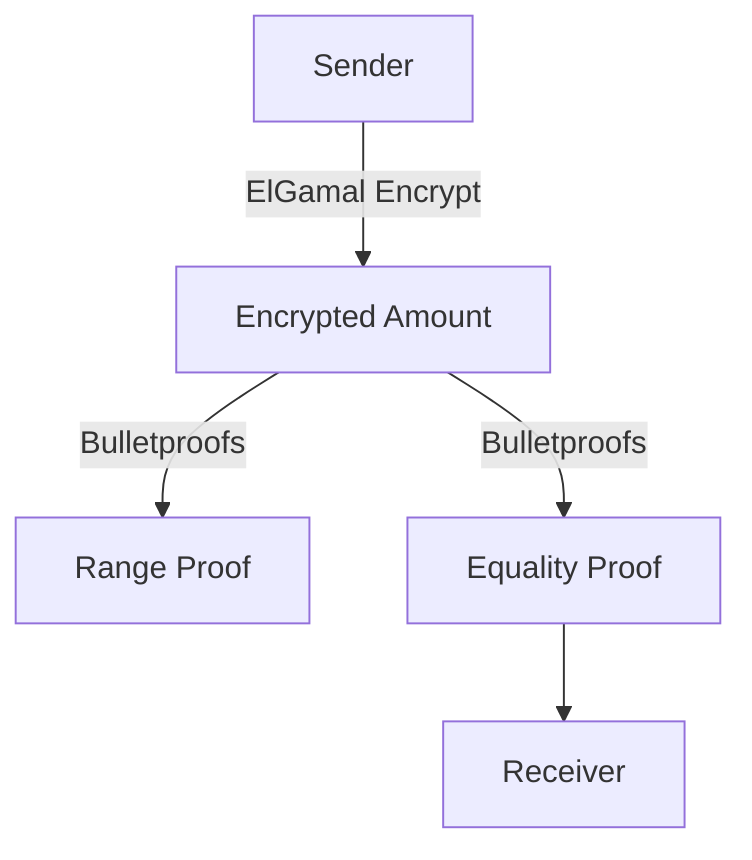

# Unlocking Privacy on Solana
**Token2022 Confidential Transfer Extension**

<div class="text-center mt-8">
  
  <p class="text-xl text-gray-300 mt-4">Privacy for Transactions, Compliance for All</p>
  <p class="text-sm text-gray-400">Presented by pupplecat | May 3, 2025</p>
</div>

<!--
Welcome the audience. Mention the online format and encourage chat interaction. Set the stage: "Today, we’ll explore how Solana hides transaction amounts."
-->

---
layout: default
transition: slide-up
---

# Agenda

```markdown
1. Solana & Tokens

2. Why Privacy?

3. Token 2022

4. Confidential Transfers

5. Cryptography

6. Use cases

7. Live Demo

8. Q&A
```

<!--
Outline the 45-min plan: 30 min slides, 10 min demo, 5 min Q&A. Encourage chat: “Type ‘Hi’ if you’re excited for the demo!”
-->

---
layout: default
transition: slide-up
---
# SPL Token

```text

                                                      ┌───────────┐
 SPL Token                                            │   Token   │                   ◄─────   Program Account
                                                      └─────┬─────┘
  - mint                                                    │
  - transfer                                         own    │    own
                                                ┌───────────┴───────────┐
                                                │                       │
                                          ┌─────▼──────┐          ┌─────▼──────┐
                                          │    Mint    │          │  Account   │      ◄─────   State Account
                                          └────────────┘          └────────────┘

                                           - supply                 - mint
                                           - authority              - owner           ◄-----   Logical Owner
                                           - decimals               - amount
                                                                    - delegate

```


<!--
Explain Solana’s speed and SPL basics. Use the diagram to show the token transfer flow: Program Account mints to Mint, owns Accounts A and B, with a 10,000 token transfer. Ask: “Who’s built on Solana? Share in the chat!” Point to the diagram with annotations to highlight key parts (e.g., Mint, transfer arrow).
-->

---
layout: image-right
image: ./assets/blockchain-privacy.png
transition: slide-up
---

# Why Privacy in Blockchain?

- **Public Ledgers**: All amounts visible
- **Need for Confidentiality**:
  - Protect sensitive payments
  - Enable institutional adoption
  - Meet regulatory compliance
- **Confidential Transfer**: Hides amounts, not identities

<div class="text-sm italic mt-4 animate-pulse">
  “Privacy for payments, transparency for regulators.”
</div>

<!--
Highlight the transparency problem. Use the image to show a public transfer with visible amounts. Segue to Token2022 as the solution.
-->

---
layout: default
transition: slide-up
---

# Token2022: Beyond SPL Token

```text

                                                     ┌────────────┐
 SPL Token 2022                                      │ Token 2022 │                   ◄─────   Program Account
                                                     └──────┬─────┘
  - confidential transfer                                   │
  - fees                                             own    │    own
  - hooks                                       ┌───────────┴───────────┐
  - metadata                                    │                       │
  - etc.                                  ┌─────▼──────┐          ┌─────▼──────┐
                                          │    Mint    │          │  Account   │      ◄─────   State Account
                                          └────────────┘          └────────────┘
                                     ─    *   Ext #1   *          *   Ext #1   *      ─
                                     │    **************          **************      │
                                     │    *    ...     *          *    ...     *      │
                     not extendable  │    **************          **************      │   extendable
                                     │    *   Ext #n   *          *   Ext #n   *      │
                                     ─    **************          **************      ─


                                   Program ID: TokenzQdBNbLqP5VEhdkAS6EPFLC1PHnBqCXEpPxuEb
```

<!--
Contrast SPL’s limitations with Token2022’s features. Show a diagram of extended mint storage if time allows. Mention privacy as a key upgrade.
-->

---
layout: default
transition: slide-up
---

# Confidential Transfer Extension

```text

 Confidential Transfer


   What It Does :
        - Hides transfer amounts                                                          Mint
        - Keeps sender/receiver public                                             ┌─────────────────┐
        - Optional auditor key                      Confidential mint is optional  │   Account Data  │
                                                                                   ├─────────────────┤
   Workflow :                                               - confidential_mint    │     CT Ext.     │
        1. Create mint with extension                       - confidential_burn    └─────────────────┘
        2. Configure accounts
        3. Deposit to encrypted balance
        4. Transfer confidentially
        5. Apply/withdraw balance


                                Account A         1. deposit          4. withdraw      Account B
                            ┌─────────────────┐                                    ┌─────────────────┐
                Public Data │   Account Data  │ ───┐                          ┌──► │   Account Data  │
                            ├─────────────────┤    │                          │    ├─────────────────┤ 3. apply_pending
             Encrypted Data │     CT Ext.     │ ◄──┘      2. ct_transfer      └─── │     CT Ext.     │    _balance
                            └─────────────────┘ ─────────────────────────────────► └─────────────────┘
```

<!--
Explain confidentiality vs. anonymity. Use the image to show extended storage (public/encrypted balances). Preview the demo: “We’ll hide an amount soon!”
-->

---
layout: center
transition: zoom
---

# Cryptography Behind It

<div class="grid grid-cols-2 gap-6">
  <div class="bg-white bg-opacity-10 p-4 rounded-lg shadow-lg">
    <h3 class="font-bold">Encryption</h3>
    <ul class="text-sm">
      <li>ElGamal: Hides balances</li>
      <li>AE Keys: Secure transfers</li>
    </ul>
  </div>
  <div class="bg-white bg-opacity-10 p-4 rounded-lg shadow-lg">
    <h3 class="font-bold">Zero-Knowledge Proofs</h3>
    <ul class="text-sm">
      <li>Bulletproofs: Range/equality</li>
      <li>zk_elgamal_proof_program_id</li>
    </ul>
  </div>
</div>



<!--
Simplify crypto: “ElGamal locks the amount, Bulletproofs prove it’s valid.” Use the Mermaid diagram to show the flow. Keep it brief for non-developers.
-->

---
layout: image-left
image: https://via.placeholder.com/400x600.png?text=Use+Cases
---

# Use Cases & Benefits

- **Use Cases**:
  - Stablecoins (Paxos USDP)
  - Payroll (hidden salaries)
  - B2B settlements
  - Compliance (auditor keys)
- **Benefits**:
  - Native integration
  - Scalable on Solana
  - Compliance-friendly
- **Challenges**:
  - Limited wallet support
  - Extension conflicts

<!--
Highlight real-world examples (Paxos). Acknowledge challenges for credibility. Ask: “What use cases do you see? Share in the chat!”
-->

---
layout: center
transition: fade
---

# Live Demo: Hiding the Amount

- **Objective**: Create a token and transfer it confidentially, showing the amount is encrypted.
- **Tools**: Solana CLI, local validator
- **Steps**:
  1. Create confidential mint
  2. Set up accounts
  3. Deposit to encrypted balance
  4. Transfer (amount hidden)
  5. Check Solana Explorer

<div class="text-sm mt-4 animate-bounce">
  Watch the amount disappear!
</div>


<!--
Set up excitement: “We’ll prove the amount is invisible!” Share terminal, use annotations, and show the Explorer mockup. Engage: “Guess the amount in the chat!”
-->

---
layout: center
class: bg-purple-900 text-white
transition: zoom
---

# Key Takeaways

<div class="text-left max-w-3xl mx-auto">
  - **Privacy**: Hides amounts with Confidential Transfer
  - **Secure**: ElGamal encryption, Bulletproofs
  - **Practical**: Stablecoins, payroll, compliance
  - **Accessible**: Easy with Solana CLI
</div>


<!--
Recap the demo: “We hid the amount!” Encourage exploration of Token2022. Transition to Q&A.
-->

---
layout: center
class: bg-blue-900 text-white
transition: fade
---

# Q&A and Resources

<div class="grid grid-cols-2 gap-6">
  <div>
    <h3 class="font-bold">Ask Away!</h3>
    <p class="text-sm">What’s on your mind? Use the chat!</p>
  </div>
  <div>
    <h3 class="font-bold">Resources</h3>
    <ul class="text-sm">
      <li><a href="https://spl.solana.com/token-2022">Solana Docs</a></li>
      <li><a href="https://github.com/solana-labs/solana-program-library">GitHub</a></li>
      <li><a href="https://spl.solana.com/confidential-token">CLI Guide</a></li>
    </ul>
  </div>
</div>


<!--
Encourage questions via chat. Share the QR code for docs. Thank the audience: “You’ve been awesome!”
-->

---
# Custom Styling
<style>
.animate-pulse {
  animation: pulse 2s infinite;
}
.animate-bounce-in {
  animation: bounceIn 1s ease-in-out;
}
.animate-slide-in-right {
  animation: slideInRight 1s ease-in-out;
}
.animate-spin-slow {
  animation: spin 10s linear infinite;
}
@keyframes pulse {
  0%, 100% { opacity: 1; }
  50% { opacity: 0.5; }
}
@keyframes bounceIn {
  0% { transform: scale(0.3); opacity: 0; }
  50% { transform: scale(1.05); opacity: 1; }
  100% { transform: scale(1); }
}
@keyframes slideInRight {
  0% { transform: translateX(100%); opacity: 0; }
  100% { transform: translateX(0); opacity: 1; }
}
@keyframes spin {
  0% { transform: rotate(0deg); }
  100% { transform: rotate(360deg); }
}
</style>


```
┌────────────┐
│            │
│            │
│ Account    │
│            │
│            │
┼────────────┤
│            │
│ CT Ext.    │
│            │
│            │
└────────────┘
```